# How to use Assertions in JMeter (Response Example)
## What is an Assertion?

Assertions help verify that your server under test returns the expected results.

## Types of Assertions

Following are some commonly used Assertions in JMeter:

- Response Assertion
- Duration Assertion
- Size Assertion
- XML Assertion
- HTML Assertion

## Steps to use Response Assertion

### Response Assertion

The response assertion lets you add pattern strings to be compared against various fields of the server response.

For example, you send a user request to the website [http://www.google.com](http://www.google.com) and get the server response. You can use Response Assertion to verify if the server response contains the expected pattern string (e.g. “OK”).

### Duration Assertion

The Duration Assertion tests that each server response was received within a **given amount** of time. Any response that takes longer than the given number of milliseconds (specified by the user) is marked as a failed response.

For example, a user request is sent to [www.google.com](http://www.google.com) by JMeter and gets a response within the expected time of 5 ms, then the test case passes; else, the test case fails.

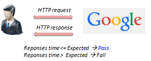

### Size Assertion

The Size Assertion tests that each server response contains the expected number of bytes. You can specify that the size be equal to, greater than, less than, or not equal to a given number of bytes.

JMeter sends a user request to [www.google.com](http://www.google.com) and gets a response packet with a size less than the expected 5000 bytes, then the test case passes; else, the test case fails.

## Size Assertion

The Size Assertion tests that each server response contains the expected number of byte in it. You can specify that the size be equal to, greater than, less than, or not equal to a given number of bytes.

JMeter sends a user request to [www.google.com](http://www.google.com) and gets response packet with size less than expected byte 5000 bytes a test case pass. If else, test case failed.

## XML Assertion

The XML Assertion tests that the response data consists of a formally correct XML document.

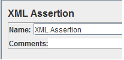

## HTML Assertion

The HTML Assertion allows the user to check the HTML syntax of the response data. It means the response data must be met the HTML syntax.

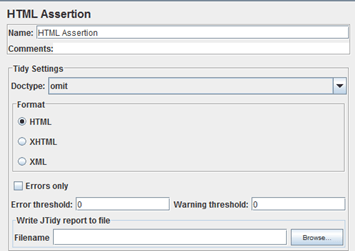

## Steps to use Response Assertion

We will continue on the script we developed in the earlier tutorial. For more details, refer to the [JMeter Performance & Load Testing](../JMeter%20Performance%20&%20Load%20Testing.md) file.

In this test, we are using **Response Assertion** to compare the response packet from www.google.com matches your expected string.

Here is the **roadmap** for this test:

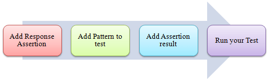

The response assertion control panel lets you add pattern strings to be compared against various fields of the response.

## Step 1) Add Response Assertion
Right-Click **Thread Group -> Add -> Assertions -> Response Assertion**

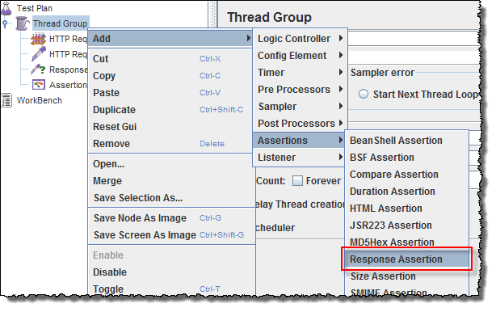

Response Assertion Pane displays as below figure:

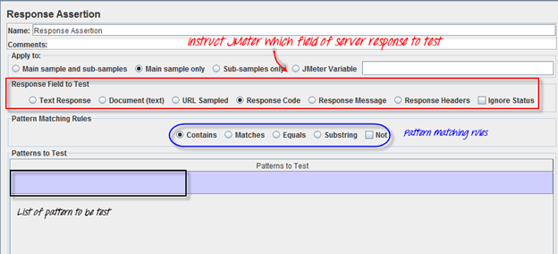

## Step 2) Add Pattern to test
When you send a request to Google server, it may return some **response code** as below:

- **404:** Server error
- **200:** Server OK
- **302:** Web server redirects to other pages. This usually happens when you access google.com from the outside USA. Google re-directs to country-specific website. As shown below, google.com redirects to google.co.in for Indian Users.

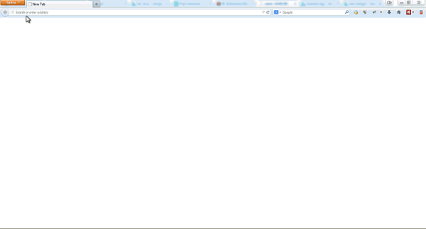

https://www.guru99.com/images/GoogleRedirect.gif

Assume that you want to verify that the web server google.com responses code contains pattern **302**,

On **Response Field To Test**, choose Response Code,

On Response Assertion Panel, click **Add ->** a new blank entry display -> **enter 302** in Pattern to Test.

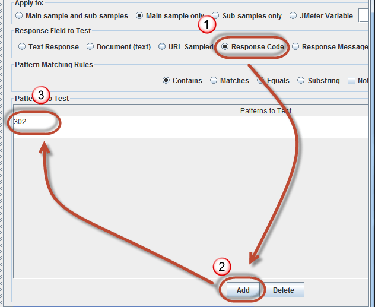

## Step 3) Add Assertion Results

Right click Thread Group, **Add -> Listener -> Assertion Results**

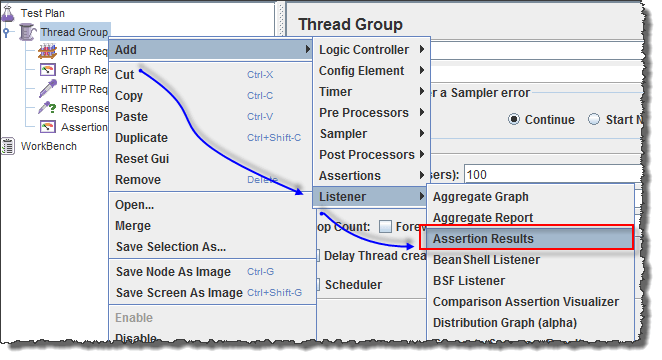

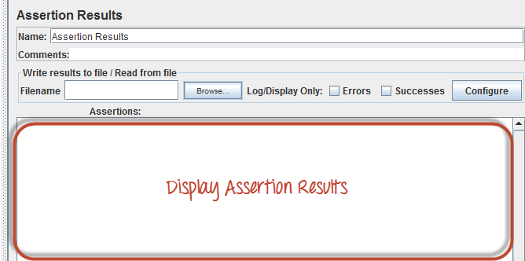

##Step 4) Run your test

**Click on Thread Group -> Assertion Result**

When you ready to run a test, click **the Run** button on the menu bar, or short key **Ctrl+R**.

The test result will display on the Assertion Results pane. If Google server **response code** contains the pattern **302**, the test case is **passed**. You will see the message displayed as follows:

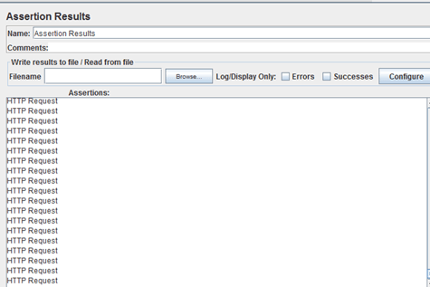

Now back to the Response Assertion Panel, you change the Pattern to test to from 302 to 500.

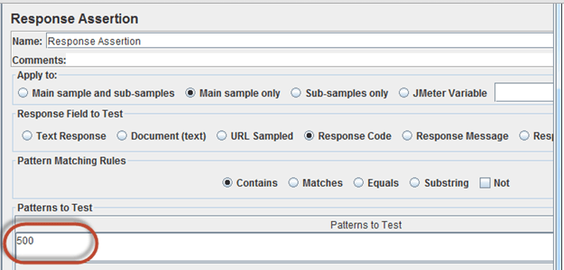

Because Google server response code doesn’t contain this pattern, you will see the test case Failed as following:

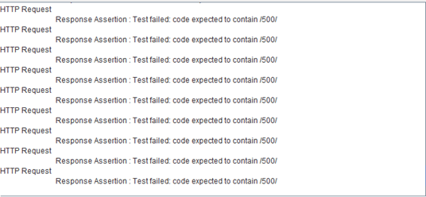

## Troubleshooting

If you face the issue while running the above scenarios … do the following:

1. Check whether you are connecting to the internet via a proxy. If yes, remove the proxy.
2. Open a new instance of JMeter
3. Open the AssertionTestPlan.jmx in JMeter
4. Click on Thread Group -> Assertion Result
Run the Test
