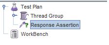

# How to use Assertions in JMeter (Response Example)

## What is an Assertion?

Assertion help verifies that your server under test returns the expected results.

## Types of Assertions

Following are some commonly used Assertion in JMeter:c

- Response Assertion
- Duration Assertion
- Size Assertion
- XML Assertion
- HTML Assertion
- Steps to use Response Assertion

## Response Assertion

