# JMeter Performance & Load Testing
## How to Use JMeter for Performance & Load Testing

## JMeter Load Testing

**JMeter Load Testing** is a testing process done using a load testing tool named Apache JMeter which is open source desktop application based on Java. JMeter for load testing is a crucial tool that determines whether the web application under test can satisfy high load requirements or not. It also helps to analyse overall server under heavy load.

## JMeter Performance Testing

**JMeter Performance Testing** is Testing method performed using Apache JMeter to test the performance of a web application. JMeter for performance testing helps to test both static and dynamic resources, helps to discover concurrent users on website and provides variety of graphical analysis for performance testing. JMeter performance testing includes load test and stress test of web application.

Apache JMeter testing tool offers following **benefit** in **Performance Testing**

    - JMeter can be used to test the performance of both static resources such as JavaScript and HTML, as well as dynamic resources, such as JSP, Servlets, and AJAX.
    - JMeter can discover maximum number of concurrent users that your website can handle
    - JMeter provides a variety of graphical analyses of performance reports.

JMeter Performance Testing includes:

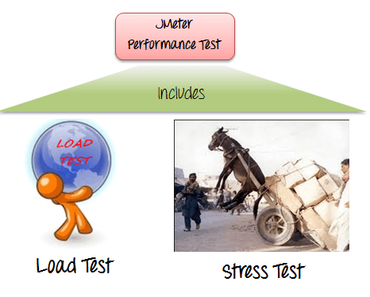

    - Load Testing: Modeling the expected usage by simulating multiple user access the Web services concurrently.
    - Stress Testing: Every web server has a maximum load capacity. When the load goes beyond the limit, the web server starts responding slowly and produce errors. The purpose of the Stress Testing is to find the maximum load the web server can handle.

The figure below shows how JMeter load Testing simulates the heavy load:

## Create a Performance Test Plan in JMeter

In this tutorial, we are doing a performance analysis of Google.com for 1000 users using various performance testing tools to ensure the website can handle the load and provide a seamless user experience.

Before testing the performance of target web application, we should determine-

    - Normal Load: Average number of users visit your website
    - Heavy Load: The maximum number of users visit your website
    - What is your target in this test?

Here is the **roadmap** of this practical example

## Step 1) Add Thread Group

    1.Start JMeter
    2.Select Test Plan on the tree
    3.Add Thread Group

Right click on the “Test Plan” and add a new thread group: **Add -> Threads (Users) -> Thread Group**

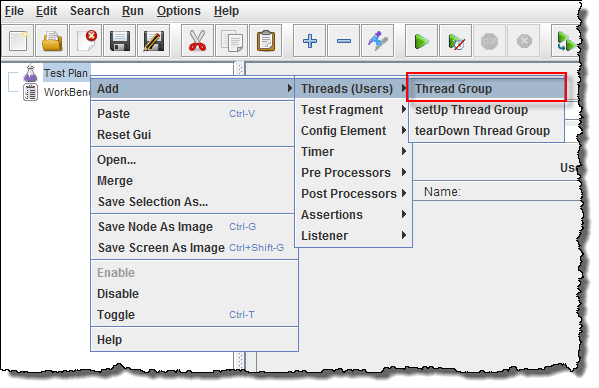

In the Thread Group control panel, enter Thread Properties as follows:

    - Number of Threads: 100 (Number of users connects to the target website: 100)
    - Loop Count: 10 (Number of time to execute testing)
    - Ramp-Up Period: 100

The Thread Count and The Loop Counts are **different.**

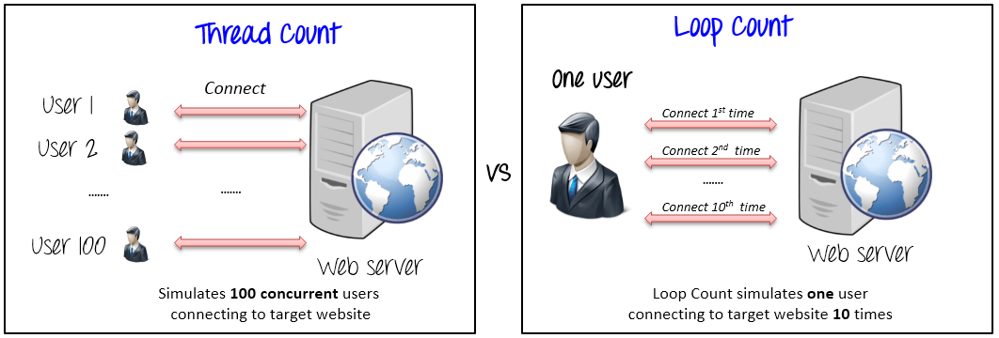

Ramp-Up Period tells JMeter how long to delay before starting the next user. For example, if we have 100 users and a 100-second Ramp-Up period, then the delay between starting users would be 1 second (100 seconds /100 users)

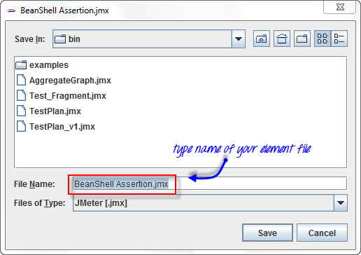

## Step 2) Adding JMeter elements

Now we determine what JMeter elements in this test. The elements are

- ## HTTP request Default

This element can be added by right-clicking on the Thread Group and selecting: **Add -> Config Element -> HTTP Request Defaults.**

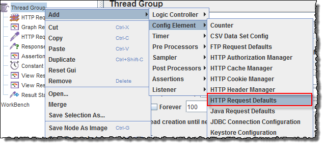

In the HTTP Request Defaults control panel, enter the Website name under test (http://www.google.com)

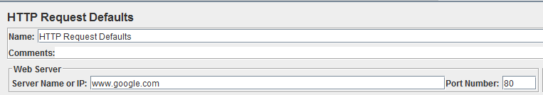

- ## HTTP Request

Right-click on Thread Group and select: **Add -> Sampler -> HTTP Request.**

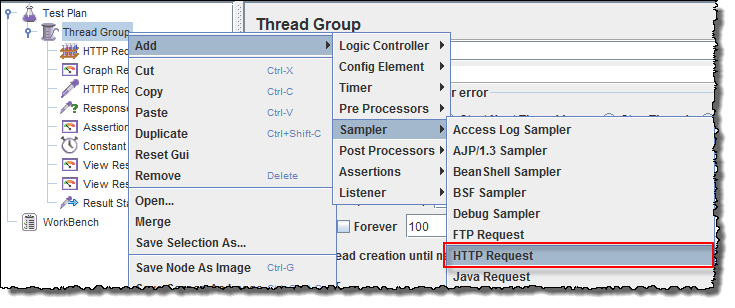

In HTTP Request Control Panel, the Path field indicates which URL request you want to send to Google server.

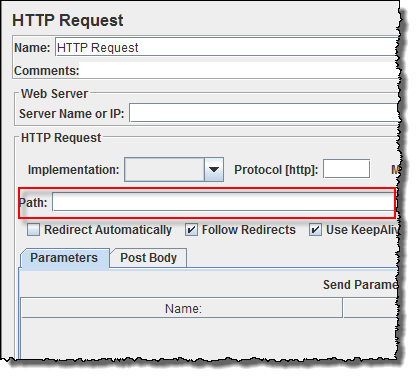

For example, if you enter “calendar” in Path field. JMeter will create the URL request http://www.google.com/calendar to Google server

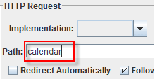

If you keep the Path field blank JMeter will create the URL request http://www.google.com to Google server.

**In this test, you keep the Path field blank to make JMeter create the URL request http://www.google.com to Google server.**

## Step 3) Adding Graph result

JMeter can show the test result in Graph format.

Right click Test Plan, **Add -> Listener -> Graph Results**

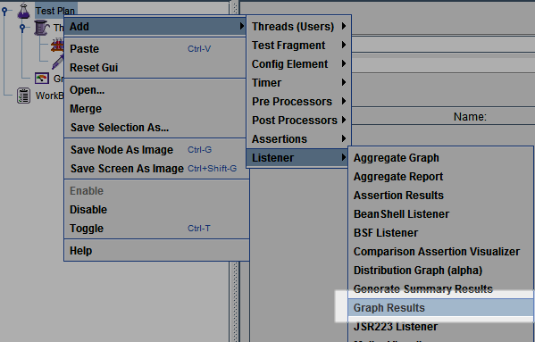

## Step 4) Run Test and get the test result

Press **the Run** button (Ctrl + R) on the Toolbar to start the software testing process. You will see the test result display on Graph in the real time.

The picture below presents a graph of a test plan, where we simulated 100 users who accessed on website www.google.com.

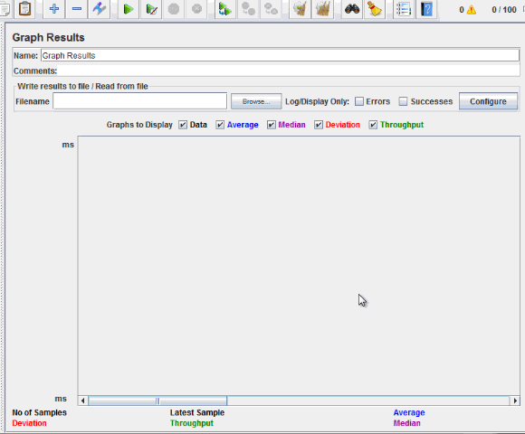

At the bottom of the picture, there are the following statistics, represented in colors:

- Black: The total number of current samples sent.
- **Blue**: The current average of all samples sent.
- **Red**: The current standard deviation.
- **Green**: Throughput rate that represents the number of requests per minute the server handled

Let analyze the performance of Google server in below figure.

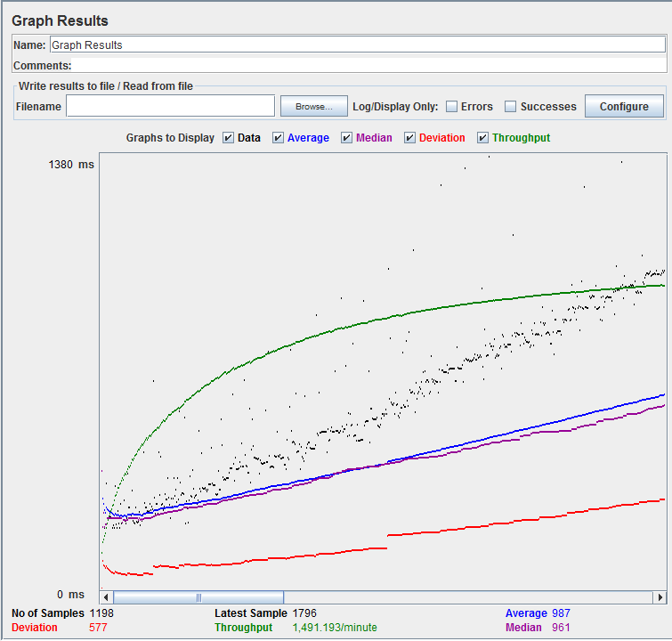

To analyze the performance of the web server under test, you should focus on 2 parameters

- **Throughput**
- **Deviation**

The Throughput is the most important parameter. It represents the ability of the server to handle a heavy load. The higher the Throughput is, the better is the server performance.

In this test, the throughput of Google server is 1,491.193/minute. It means Google server can handle 1,491.193 requests per minute. This value is quite high so we can conclude that Google server has good performance

The deviation is shown in red – it indicates the deviation from the average. The smaller the better.

Let compare the performance of Google server to other web servers. This is the performance test result of website http://www.yahoo.com/ (You can choose other websites)

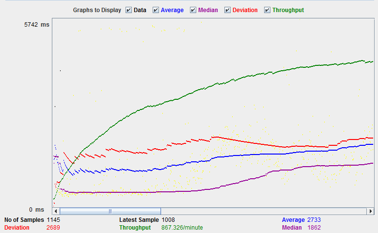

The throughput of a website under test http://www.yahoo.com is 867.326/minutes. It means this server handle 867.326 requests per minute, lower than Google.

The deviation is 2689, much higher than Google (577). So we can determine the performance of this website is less than a Google server.

**NOTE:** The above values depend on several factors like current server load at Google, your internet speed, your CPU power etc. Hence, it’s very unlikely that you will get the same results as above. So don’t panic! If you’re interested in understanding how server load impacts performance and how to test it, you might find this load testing tutorial useful.

## Troubleshooting
If you face the issue while running the above scenario … do the following

1. Check whether you are connecting to the internet via a proxy. If yes, remove the proxy.
2. Open a new instance of Jmeter
3. Open the PerformanceTestPlan.jmx in Jmeter
4. Double Click on Thread Group -> Graph Result
5. Run the Test

