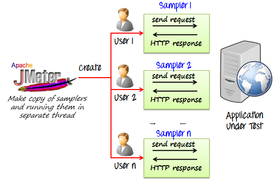
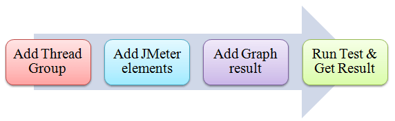

# JMeter Performance & Load Testing
## How to Use JMeter for Performance & Load Testing

## JMeter Load Testing

**JMeter Load Testing** is a testing process done using a load testing tool named Apache JMeter which is open source desktop application based on Java. JMeter for load testing is a crucial tool that determines whether the web application under test can satisfy high load requirements or not. It also helps to analyse overall server under heavy load.

## JMeter Performance Testing

**JMeter Performance Testing** is Testing method performed using Apache JMeter to test the performance of a web application. JMeter for performance testing helps to test both static and dynamic resources, helps to discover concurrent users on website and provides variety of graphical analysis for performance testing. JMeter performance testing includes load test and stress test of web application.

Apache JMeter testing tool offers following **benefit** in **Performance Testing**

    - JMeter can be used to test the performance of both static resources such as JavaScript and HTML, as well as dynamic resources, such as JSP, Servlets, and AJAX.
    - JMeter can discover maximum number of concurrent users that your website can handle
    - JMeter provides a variety of graphical analyses of performance reports.

JMeter Performance Testing includes:

    - Load Testing: Modeling the expected usage by simulating multiple user access the Web services concurrently.
    - Stress Testing: Every web server has a maximum load capacity. When the load goes beyond the limit, the web server starts responding slowly and produce errors. The purpose of the Stress Testing is to find the maximum load the web server can handle.

The figure below shows how JMeter load Testing simulates the heavy load:

## Create a Performance Test Plan in JMeter

In this tutorial, we are doing a performance analysis of Google.com for 1000 users using various performance testing tools to ensure the website can handle the load and provide a seamless user experience.

Before testing the performance of target web application, we should determine-

    - Normal Load: Average number of users visit your website
    - Heavy Load: The maximum number of users visit your website
    - What is your target in this test?

Here is the **roadmap** of this practical example

## Step 1) Add Thread Group

    1.Start JMeter
    2.Select Test Plan on the tree
    3.Add Thread Group

Right click on the “Test Plan” and add a new thread group: **Add -> Threads (Users) -> Thread Group**

In the Thread Group control panel, enter Thread Properties as follows:

    - Number of Threads: 100 (Number of users connects to the target website: 100)
    - Loop Count: 10 (Number of time to execute testing)
    - Ramp-Up Period: 100

The Thread Count and The Loop Counts are **different.**

