# Jmeter Timers: Constant, Gaussian Random, Uniform [Example]

## What are Timers?

By default, JMeter sends the request without pausing between each request. In that case, JMeter could overwhelm your test server by making too many requests in a short amount of times.

Let imagine that you send thousands request to a web server under test in a few seconds. This is what happens!

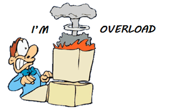

Timers allow JMeter to **delay** between each request which a thread makes. A timer can solve the server **overload** problem.

Also, **in real life visitors do not arrive at a website all at the same time, but at different time intervals. So Timer will help mimic the real-time behavior.**

Following are some **common** types of a timer in JMeter

## Constant Timer

Constant timer delays each user request for the **same** amount of time.

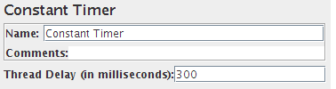

## Gaussian Random Timer

Gaussian random timer delays each user request for a **random** amount of time.

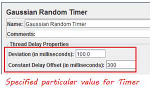

## Parameters
| Attribute                      | Description                                           |
|--------------------------------|-------------------------------------------------------|
| Name                           | Descriptive name for this timer that is shown in the tree |
| Deviations (milliseconds)      | A parameter of Gaussian Distribution Function         |
| Constant Delay Offset (milliseconds) | Additional value in milliseconds                    |

So the total delay is described as below figure:

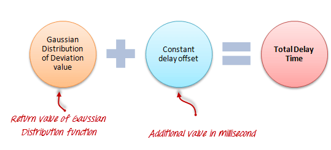

## Uniform Random Timer

Uniform random timer delays each user request for a random amount of time.

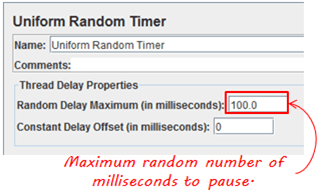

### Parameters
| Attribute                      | Description                                           |
|--------------------------------|-------------------------------------------------------|
| Name                           | Descriptive name for this timer that is shown in the tree |
| Random Delay Maximum           | Maximum random number of milliseconds to delay.       |
| Constant Delay Offset (milliseconds) | **Additional** value in milliseconds                    |

**The total delay is the sum of the random value and the offset value.**

### BeanShell Timer
The BeanShell Timer can be used to **generate** a delay time between each user request.

### BSF Timer
The BSF Timer can be used to generate a delay between each user request using a BSF scripting language.

### JSR223 Timer
The JSR223 Timer can be used to generate a delay between each user request using a JSR223 scripting language

## How to Use Constant Timer
In this example, you will use **Constant Timer** to set **a fixed delay** between user requests to google.com.

Let start with a simple test script

1. JMeter creates one user request to http://www.google.com **100** times
2. Delay between each user request is **5000** ms
Here is the **roadmap** for this practical example:

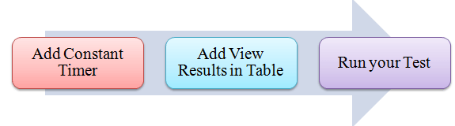

### Pre-condition
We re-use the Step 1 and Step 2 in tutorial [JMeter Performance & Load Testing](JMeter%20Performance%20%26%20Load%20Testing.md)JMeter Performance Testing.

### Step 1) Add Thread Group
Right click on the Test Plan and add a new thread group: **Add-> Threads (Users) ->Thread Group**

In Thread Group control panel, enter Thread Properties as following

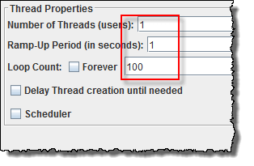

This setting lets JMeter create **one** user request to http://www.google.com in **100** times

## Step 2) Add JMeter elements
    - Add HTTP request default
    - Add HTTP request

## Step 3) Add Constant Timer
Right-click **Thread Group -> Timer -> Constant Timer**

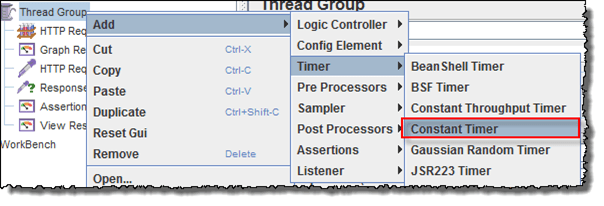

Configuring Thread Delay of 5000 milliseconds

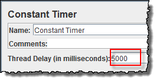

### Step 4) Add View Results in Table
View Results in Table displays the test result in table format.

Right click **Add -> Listener ->View Result in Table**

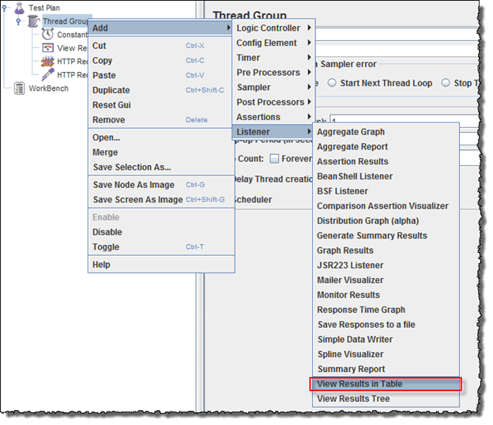

View Results in Table displays as below figure

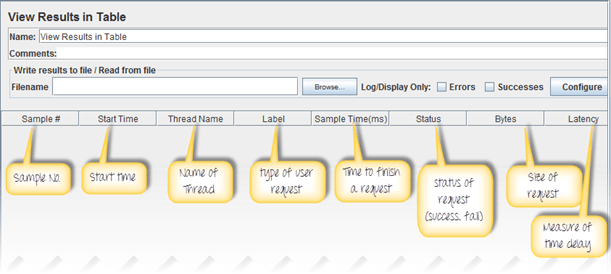

### Step 5) Run your test
When you ready to run a test, click the Run button on the menu bar, or short key Ctrl+R

This is the result of this test

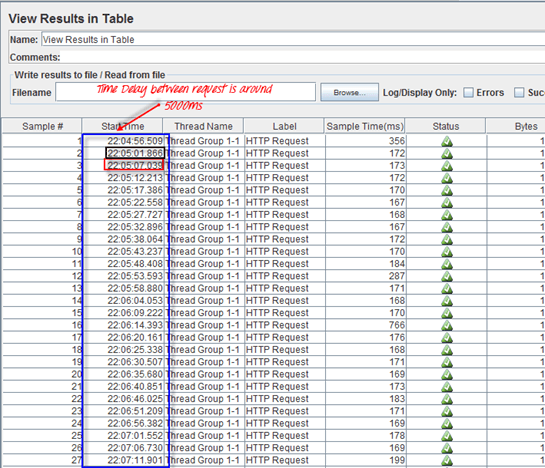

For example, in the above figure, let analyze the **Sample 2**

- **Start time** is 22:05:01.866
- **Sample Time** of Sample 2 is 172 ms
- **Constant Timer:** 5000 ms (as configured)
- **End Time** of this sample is = 22:05:01.866 + 172 + 5000 = 22:05:07.038

So the Sample 3 should start at the time is **22:05:07.039** ( As shown in the above figure)

The **delay** of each sample is **5000** ms

If you change the Constant Timer is **zero,** you will see the result is changed

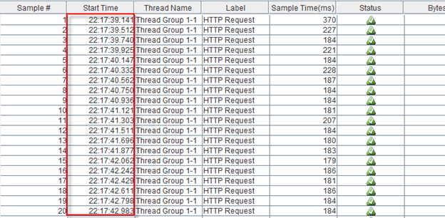

Let analyze the **Sample 1**

- **Start time** is 22:17:39.141
- **Sample Time** of Sample 2 is 370 ms
- **Constant Timer** : 0 ms (as configured)
- **End Time** of this sample is = 22:17:39.141+ 370 + 0 = 22:17:39.511

So the **Sample 2** should start at the time is **22:17:39.512** (Shown in the above figure)

### Troubleshooting
If you face the issue while running the above scenario … do the following

1. Check whether you are connecting to the internet via a proxy. If yes, remove the proxy.
2. Open a new instance of JMeter
3. Open the TimerTestPlan.jmx in Jmeter
4. Double Click on Thread Group -> View Result in Table
5. Run the Test