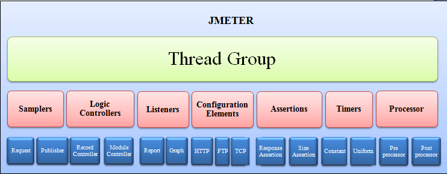
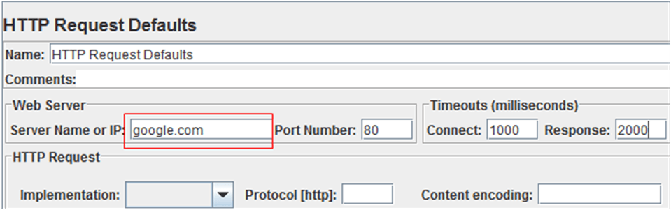
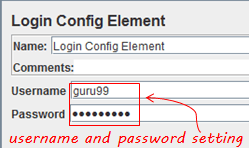
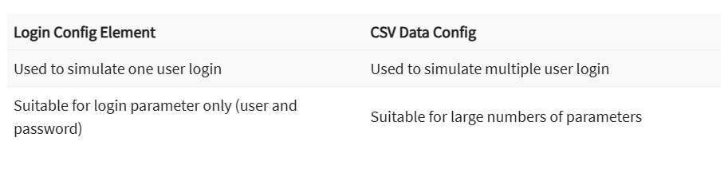
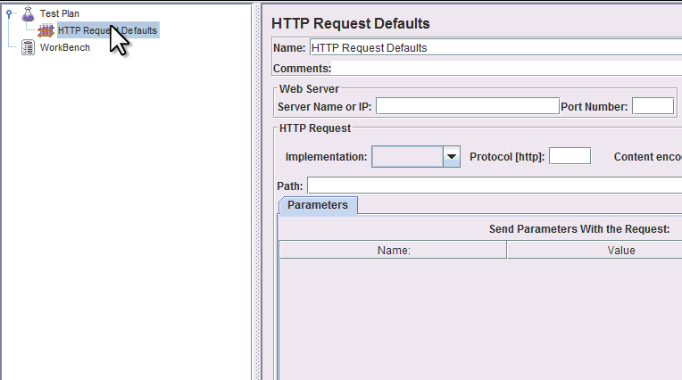
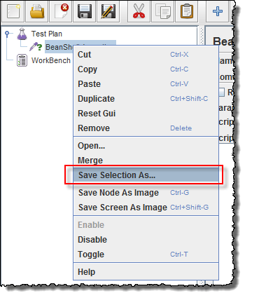

# Test-Automation
C# with selenium 

<h2>Topics Cover</h2>

**Introduction**

**API Basics**

<h2>Groups of Status code</h2>

- 1xx: Informational
- 2xx: Success 
    - 200 OK: The request has succeeded. (GET, POST, PUT, DELETE)
    - 201 Created: The request has been fulfilled and resulted in a new resource being created. (POST, PUT)
    - 202 Accepted: The request has been accepted for processing, but the processing has not been completed. (POST, PUT)
    - 204 No Content: The server successfully processed the request, but is not returning any content. (DELETE)
- 3xx: Redirection
    - 301 Moved Permanently: The resource has been moved to a new URL permanently. (GET)
    - 302 Found: The resource is temporarily located at a different URL. (GET)
    - 304 Not Modified: The resource has not been modified since the last request. (GET)
- 4xx: Client Errors
    - 400 Bad Request: The server could not understand the request due to invalid syntax. (GET, POST, PUT, DELETE)
    - 401 Unauthorized: The client must authenticate itself to get the requested response. (GET, POST, PUT, DELETE)
    - 403 Forbidden: The client does not have access rights to the content. (GET, POST, PUT, DELETE)
    - 404 Not Found: The server can not find the requested resource. (GET, POST, PUT, DELETE)
    - 405 Method Not Allowed: The request method is known by the server but has been disabled and cannot be used. (GET, POST, PUT, DELETE)
    - 429 Too Many Requests: The user has sent too many requests in a given amount of time. (GET, POST, PUT, DELETE)
- 5xx: Server Errors
    - 500 Internal Server Error: The server has encountered a situation it doesn't know how to handle. (GET, POST, PUT, DELETE)
    - 501 Not Implemented: The request method is not supported by the server and cannot be handled. (GET, POST, PUT, DELETE)
    - 502 Bad Gateway: The server, while acting as a gateway or proxy, received an invalid response from the upstream server. (GET, POST, PUT, DELETE)
    - 503 Service Unavailable: The server is not ready to handle the request. (GET, POST, PUT, DELETE)
    - 504 Gateway Timeout: The server, while acting as a gateway or proxy, did not get a response in time from the upstream server. (GET, POST, PUT, DELETE)
    - 505 HTTP Version Not Supported: The HTTP version used in the request is not supported by the server. (GET, POST, PUT, DELETE)5xx: Server Errors

    <h2>Postman Componets and Features</h2>
    **Postman Components and Features**

    **REQUESTS VIEW**

    - **Request Types**: GET, POST, PUT, DELETE, etc.
    - **Headers**: Customize request headers.
    - **Body**: Add request payloads for POST, PUT, PATCH requests.
    - **Params**: Add query parameters to your requests.
    - **Authorization**: Manage different types of authorization (e.g., API Key, OAuth 2.0).
    - **Pre-request Scripts**: Write scripts to execute before sending the request.
    - **Tests**: Write scripts to execute after receiving the response.
    - **Settings**: Customize request settings like redirects, timeouts, etc.
    - **Code**: Generate code snippets for various programming languages to make the same request.
    - **Save**: Save requests to collections for reuse.

    **RESPONSES VIEW**

    - **Status Code**: View the status code returned by the server.
    - **Response Time**: Measure the time taken to get a response.
    - **Response Size**: Check the size of the response payload.
    - **Body**: View the response body in various formats (e.g., JSON, HTML, XML).
    - **Headers**: Inspect the response headers.
    - **Cookies**: Manage cookies sent by the server.
    - **Tests**: View the results of tests executed after the response is received.
    - **History**: Access the history of requests and responses for the current session.

    **VARIABLES**

    - **Global Variables**: Variables that are accessible in all environments and collections.
    - **Environment Variables**: Variables that are specific to a particular environment (e.g., development, staging, production).
    - **Collection Variables**: Variables that are specific to a particular collection.
    - **Local Variables**: Variables that are specific to a particular request or script.
    - **Data Variables**: Variables that are used to parameterize requests with data from external files (e.g., CSV, JSON).
    - **Session Variables**: Variables that are temporary and only available during the current session.
    - **Variable Scopes**: Understand the hierarchy and precedence of different variable types.
    - **Variable Substitution**: Use variables in request URLs, headers, body, scripts, and tests.
    - **Managing Variables**: Create, update, and delete variables using the Postman interface or scripts.
    - **Persisting Variables**: Save variable values between sessions and requests.

    **SCRIPTS**
    
    **Pre-request Scripts**: Write scripts to execute before sending the request to set variables, manipulate data, or perform other setup tasks.

    **Test Scripts**: Write scripts to execute after receiving the response to validate data, set variables, or perform other checks.

    **Script Libraries**: Use external libraries in your scripts to extend functionality.

    **Script Execution Order**: Understand the order in which scripts are executed (e.g., pre-request scripts, request scripts, test scripts).

    **Debugging Scripts**: Use Postman's console to debug and troubleshoot your scripts.

    **Script Examples**: Access a variety of script examples and templates to get started quickly.

    **Managing Scripts**: Organize and manage your scripts within collections and environments.

    **COLLECTIONS**

    - **Collections**: Organize your API requests into collections for better management and sharing.
    - **Environments**: Manage different environments (e.g., development, staging, production) with environment variables.
    - **Tests**: Write tests using JavaScript to validate API responses and automate testing.
    - **Monitors**: Schedule automated tests to run at specific intervals and monitor API performance.
    - **Mock Servers**: Simulate API endpoints to test and develop without actual backend services.
    - **Documentation**: Generate and publish API documentation directly from your collections.
    - **Workspaces**: Collaborate with team members in shared workspaces.
    - **API Network**: Discover and connect with public APIs available in the Postman API Network.
    - **Integrations**: Integrate Postman with other tools and services like Jenkins, GitHub, and Slack.
    - **Postman CLI (Newman)**: Run Postman collections from the command line for CI/CD integration.

    <h2>Why is Authorization in API?</h2>
    - Number of API calls should be controlled - you want to restrict the number of API calls per day/month/year per a user.    

    ##  What is HTTP GET?

    - Used to request data from server
    - In CRUD operations it is analogous to READ operations.
    - Should only fetch data from server.
    - Should not have request body.

    ## What is Elements in Jmeter?
    
    The different Components of Jmeter are called Elements. Each Elements is designed for a specific purpose.

    The figure below gives some common Elements in Jmeter.
    

    

    Studying all the components in one go is an invitation to confusion and boredome. Here, we will discuss the must-know components before we can start Testing in JMeter.

    Remaining components will be discussed as when they are used in the succeeding topics. The elements discussed in this topics are

    ## Thread Group

    Thread Groups is a collection of Threads. Each thread represents one user using the application under test. Basically, each Thread simulates one real user request to the server.

    The controls for a thread group allow you to Set the number of threads for each group.

    For example, if you set the number of threads as 100; JMeter will create and simulate 100 user requests to the server under test

    

    ## FTP request

    Let’s imagine you want to performance test an FTP server. You can use an FTP request sampler in JMeter to do this task. This controller lets you send an FTP “download file” or “upload file” request to an FTP server.

    

    For example, if you want to download a file “Test.txt” from an FTP server under test, you need to configure some parameters in JMeter as the figure below

    

    JMeter will send FTP command to FTP server ftp.example.com, and then download a file Test.txt from that server.

    ## HTTP request

    This sampler lets us send an HTTP/HTTPS request to a web server.

    Consider the example below. JMeter sends an HTTP request to Google website and retrieve HTML files or image from this website.

    

    ## JDBC request

    This sampler lets us execute Database Performance Testing. It sends a JDBC Request (an SQL query) to a database.

    

    For example, a database server has a field test_result stored in a table name test_tbl. we want to query this data from the database server; we can configure JMeter to send a SQL query to this server to retrieve data.

    

    ## BSF Sampler

    This sampler allows us to write a sampler using a BSF scripting language.

    Here is an example of BSF Sampler in JMeter

    

    ## Access Log Sampler

    This sampler allows you to read access logs and generate HTTP requests. The log could be image, Html, CSS…

    

    ## SMTP Sampler

    If you want to test a mail server, you can use SMTP sampler. This sampler is used to send email messages using the SMTP protocol.

    

    ## Listeners

    Listeners: shows the results of the test execution. They can show results in a different format such as a tree, table, graph or log file

    

    Graph result listeners display the server response times on a Graph

    

   View Result Tree show results of the user request in basic HTML format

   

   Table Result show summary of a test result in table format

   

   Log show summary of a test results in the text file

   

   ## CSV Data Set Config

   Suppose you want to test a website for 100 users signing-in with different credentials. You do not need to record the script 100 times! You can parameterization the script to enter different login credentials. This login information (e.g. Username, password) could be stored in a text file. JMeter has an element that allows you to read different parameters from that text file. It is “CSV Data Set Config”, which is used to read lines from a file, and split them into variables. 

   

   This is an example of CSV Data. It’s a text file which contains user and password to login your target website

   

   ## HTTP Coockie Manager

   Let’s understand this with an example –

   we used our browser (Firefox, IE…Etc) to browse www.google.com

    we log in with our user and password.

    we username and password will be stored in our computer as cookies.

    Next time, when we visit www.google.com, we don’t need to do log in again because our browser will use our cookies as user data to log in.

    HTTP Cookie Manager also has the same feature as a web browser. If we have an HTTP Request and the response contains a cookie, the Cookie Manager automatically stores that cookie and will use it for all future requests to that particular website.

    ## HTTP request default

    This element lets you set default values that your HTTP Request controllers use.

    For example,

    we are sending 100 HTTP requests to the server google.com

    we would have to manually enter server name = google.com for all these 100 requests

    Instead, we could add a single HTTP request defaults with the “Server Name or IP” field = google.com

    No need to type 100 times!

    

    This element will be explained in detail in tutorial JMeter Performance Testing

    ## Login Congig Element

    The Login Config Element lets you add or override username and password settings in samplers.

    For example, you want to simulate one user login to website www.facebook.com with user and password. You can use the Login Config Element to add this user and password setting in a user request

    

    The Login Config Element vs. the CSV data Config

    

    ## What is a Test Plan?

    Test plan is where you add elements required for your JMeter Test.

    It stores all the elements (like ThreadGroup, Timers etc) and their corresponding settings required to run your desired Tests.

    ## How to add Elements?

    Adding Elements is the essential step to build a Test Plan because without adding elements, JMeter cannot execute your Test Plan

    A Test Plan includes many Elements such as Listener, Controller, and Timer

    You can add an element to test plan by right-clicking on a Test Plan and choose new elements from “Add” list.

    Suppose, you want to add 2 elements to Test Plan BeanShell Assertion and Java Request Default

    - Right click Test Plan -> Add -> Assertion-> Bean Shell Assertion
    - Right click Test Plan -> Add -> Config Element -> Java Request Default

    

    https://www.guru99.com/images/RemoveElement.gif

    ## Loding and Saving Elements

    ## How to Create JMX file

    Suppose you have already added an element name “BeanShell Assertion“. Now you want to save it.

    Right-click BeanShell Assertion -> select <b>Save Selection As</b>

    
 

    
